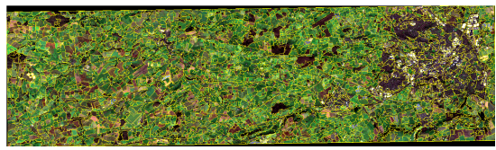

# Novel Training Methodologies for Land Classification of Sentinel-2 Imagery

### Note on IP

Due to IP issues with the industrial partner, this project cannot be reproduced exactly, due to use of proprietary libraries and processes. Therefore, this is a high-level description of the scripts and steps taken. 

## Project Overview

The goal of this project was to develop training methodologies for land-cover prediction using Sentinel-2 imagery. A presentation, given to a both technical and non-technical audience, can be found [here](presentation.pdf).

We were aiming to assess how the inclusion of spatial and textural elements in training data impacts classification accuracy. We had access to a single Sentinel-2 tile of South-West England.

Running ```scene_prep.py``` will load in our test image. We were considering RGB and Near Infrared (NIR) bands. The script merges our 4 band tifs into one raster.  


We cropped the image to approximately 40km by 11km, and altered the contrast to improve visibility:


Our ground-truth data was downloaded from the freely-available [Corine Land-Cover](https://land.copernicus.eu/pan-european/corine-land-cover) maps.

## Baseline

We had a baseline accuracy from the classification results of a Random Forest Regressor. This accuracy was our target to beat, using textural and spatial relations, with no restrictions on algorithm choice. 

## Segmentation 

Our first approach was considering the texture in the scene. Image texture is essentially the distribution of colour, and by partitioning an image based on its colour, you can form elements of similarly-coloured pixels. A method which accounts for this is graph-based segmentation, which we implemented here in ```segment.py```. First, we load in our scene in ```scene_prep.py```. By setting ```Segment = True```, we can then apply graph-based segmentation. 



By calculating the mean pixel value in each segment, we form a hierarchy of segment types. Each type represents an average colour. 


Notice how both the type 1 segments are a similar brown colour. Adding these segment values would ideally improve the classification, based on the assumption that two separate pixels with the same segment type were more
likely to belong to the same class, making the segment information a useful predictor. 

We can then form a training set of pixels. We sampled our pixels using the ```sample_raster``` function. Each instance contained the four band values for a given pixel (R, G, B and NIR), the corresponding Corine land-cover label, which was our target variable, and the extra information of the pixel segment-type, taken from the segment its belongs to. 

In ```test_segment.py```, we load in our dataset of pixel band values, segment-types and Corine labels. We wanted to experiment with neural networks, and thus implemented a Multi-Layered Perceptron (MLP). We then partition into train and test splits, and construct a triple-layered MLP. We can compare this to the Random Forest baseline, and an MLP trained without the segment type variable, to observe its effect.

We can see the results of this below.

### Predictions


Our results showed slight increases in accuracy when including the segment information as a feature on our dataset of pixels. This was promising, as it meant textural considerations could improve classification accuracy. 

## Patch-Based Training 

After establishing an improvement with textural considerations, we wanted to do the same with the image spatial relations. Running ```scene_prep.py``` with ```Segment = False```, we sampled individual pixels in the same manner as before. However this time, by entering ```sample_raster``` and applying a ```buffer```, we could extract a patch of pixels, and build a training set of patches, instead of individual pixels. 


The dataset was built and saved as an array. It is then loaded in ```patches.py```. As a reminder, our goal was still to achieve pixel-level classifications. We would be training on a patch of pixels, to then provide a prediction for the centre pixel. The training set would be constructed of pixel patches and the labels of each patch centre pixel. The two-dimensional nature of this input data meant we could now explore a Convolutional Neural Network (CNN), which are well-suited to training on image inputs. In ```patches.py``` we construct our CNN model:


The model was trained on up to 400,000 patches taken from the AOI. The patch-size ranged from 3x3 to 61x61, with the two top-performing models saved. To test the predictive power of these models, we predicted over the entire Swindon scene. In ```test_patches.py``` we partition our AOI into overlapping tiles. This allows us to make a prediction for the entire image, shown below for a CNN trained on 7x7 patches.

### Predictions


We can see clearly the coarseness of the Corine Land-Cover ground truth. The models perform well identifying the shapes and intricacy of the scene, with some misclassifications, but give a more accurate representation of the scene than the ground-truth. The low resolution of the Corine maps was a severely limiting factor on our accuracy. We can take a closer look at this effect below, also showing predictions when trained on different patch sizes: 


Clearly, the resolution of the ground-truth is extremely poor. Our models did well picking up the detailed shape of the airport above, however have both misclassified it. This was common throughout the scene. However, considering the resolution of the ground-truth, this was a good result overall. We also outperformed the baseline Random Forest, clearly showing that spatial and texture considerations, along with use of CNNs, can improve classification accuracy.

## Transfer Learning with BigEarthNet

We also wanted to experiment with transfer learning for the patch-based approach. [BigEarthNet](http://bigearth.net/) is a recently compiled dataset of Sentinel-2 image patches, and is one of the largest currently available. Each image is a 120x120 patch, with 13 spectral bands available per location. We load in the dataset in ```read_bigearth.py```. Choosing the same 4 bands we had used for the previous approaches, we reduced the dataset to images of only the classes represented in our AOI. We could then train a model in ```train_bigearth.py```. 

However, our model struggled to get above 40% accuracy when testing on our AOI. 


This could be due to the large patch sizes in the BigEarth dataset, which can overload the model with a high number of pixel values. It is also likely this was due to the poor ground-truth data available.

# Discussion 

We saw that considering patches of pixels produces excellent shape detection and a moderate accuracy (highest over AOI was 66%), even with the constraint imposed by the poor ground-truth data. This was a greater accuracy than considering textural elements alone, making spatial considerations more influential for classifying images of this nature. We also discovered that the size of patches is a strong determinant for accuracy.
